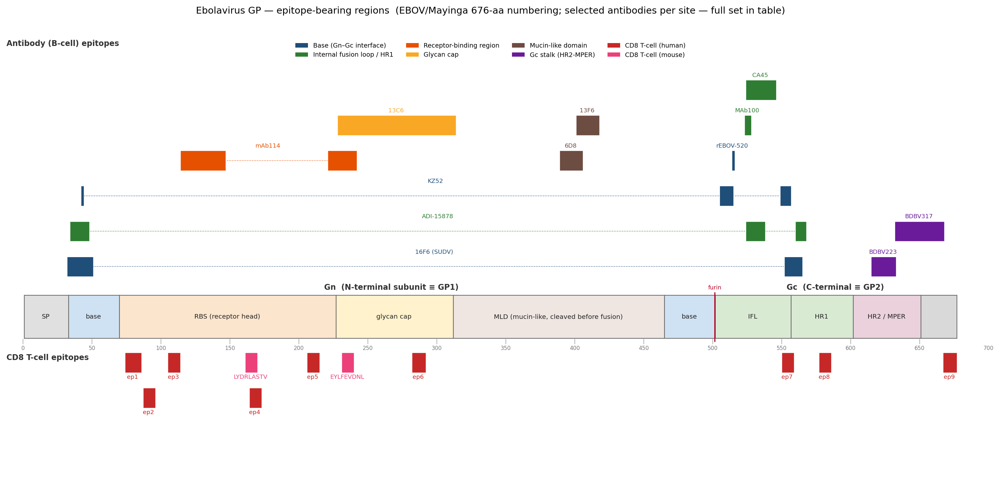

> This directory contains a set of Ebola B- and T- cell epitopes taken from the literature. The epitopes, and cross checking were done against the literature, my curated alignments in the previous directory, and PDB. However, this directory and its contents are vibe-coded, and require additional vetting.

# Ebolavirus Glycoprotein (GP) Epitope Atlas — EBOV, SUDV, BDBV, TAFV

A curated, alignment-anchored catalogue of **B-cell (antibody)** and **T-cell (CD8+)** epitopes on the ebolavirus glycoprotein, with epitope sequences, coordinates, source antibodies / HLA restrictions, and an explicit record of how each entry was verified.

Every residue position is given in a single numbering scheme — the EBOV/Mayinga 676-aa GP sequence — so the same number refers to the same position in every row, for every species. Every epitope sequence was read directly from the curated alignment or computed from structural coordinates and cross-checked against the alignment, rather than reproduced from recollection. Cells that could not be resolved are flagged rather than guessed.

> Companion spreadsheet: `Ebolavirus_GP_Epitopes.xlsx` (sheets `B_cell_epitopes`, `T_cell_epitopes`, `README`) — same content with full notes / confidence columns.

*Overview of epitope-bearing regions on GP. Antibody (B-cell) epitopes are shown above the domain bar and CD8 T-cell epitopes below it, colored by antigenic site; discontinuous epitopes are drawn as connected segments. A representative antibody is shown per site — the complete set is in the tables below. (Editable vector version: `Ebolavirus_GP_epitope_map.svg`.)*

---

## Conventions (read this first)

These apply to **every table and every section** below, so the frame is never ambiguous:

- **One numbering frame for all rows and all species** — the EBOV / Mayinga 1976 GP precursor, 676 aa. (The reference sequence is **UniProt Q05320** — a database accession for the Mayinga-76 GP, *not* a strain code.) A residue number always means a position in that 676-aa sequence, whatever species the row is about.
- **Subunit names** — **Gn** = the N-terminal subunit (residues 33–501; receptor-binding; ≡ "GP1"); **Gc** = the C-terminal subunit (residues 502–676; fusion; ≡ "GP2"). Signal peptide = 1–32. (This matches the Gn/Gc partition used in the LowVan annotation.)
- **Where the sequence letters come from** — the **GPC amino-acid alignment in the repository**, rows EBOV `186538.2733`, SUDV `186540.37`, BDBV `565995.26` (the RNA-edited, full-length GP). A sequence cell prefixed `EBOV:` / `SUDV:` / `BDBV:` lists the literal residues read from that row.
- **Discontinuous (conformational) epitopes** — listed as the set of GP residues within **≤ 4.0 Å** of the antibody Fab in the cited PDB, then checked residue-for-residue against the alignment rows above. So the **numbers are Mayinga-frame** and the **letters are from the alignment** — the structure supplies *which* residues, the alignment supplies *what* they are.

### Reference sequences

| Species | Strain | NCBI | GP protein | Alignment row |
|---|---|---|---|---|
| EBOV | Zaire / Mayinga 1976 | NC_002549.1 | UniProt Q05320 (676 aa) / NP_066246.1 | `186538.2733` |
| SUDV | Sudan / Gulu 2000 | NC_006432.1 | YP_138523.1 | `186540.37` |
| BDBV | Bundibugyo / 200706291 Uganda 2007 | NC_014373.1 | YP_003815435.1 | `565995.26` |

All three rows de-gap to exactly 676 aa; the EBOV row begins `MGVTGILQLPRD…` (= Q05320). Numbering was validated independently — published escape/contact residues (**G528, E545, N514, N563**) land on the correct residues.

---

## GP architecture (where things live)

GP is made as a single 676-aa precursor, then furin-cleaved after residue 501 into two disulphide-linked subunits: **Gn** (N-terminal, receptor-binding) and **Gc** (C-terminal, fusion). The domain map below is the orientation to keep in mind while reading the epitope tables — it explains *why* the epitopes cluster where they do.

| Region | Subunit | Residues (Mayinga frame, approx.) | Role | Epitopes here |
|---|---|---|---|---|
| Signal peptide | — | 1–32 | cleaved off; absent from mature GP | — |
| Base subdomain | **Gn** | ~33–69 (+ return strands near 460–501) | clamps Gn onto Gc at the subunit interface | KZ52, 2G4, 4G7, 16F6 |
| Receptor-binding head (RBS) | **Gn** | ~70–226 | engages the endosomal receptor NPC1 | mAb114, FVM04; T-cell ep1–4 |
| Glycan cap | **Gn** | ~227–311 | glycosylated lid over the RBS; removed during entry | 13C6, FVM09, BDBV270/289; T-cell ep5–6 |
| Mucin-like domain (MLD) | **Gn** | ~312–464 | heavily O-/N-glycosylated, disordered "skirt"; **clipped off by cathepsins before fusion** | 6D8, 13F6, MLD-3 (linear only) |
| *(furin cleavage site)* | — | after 501 | the Gn / Gc boundary | — |
| Internal fusion loop (IFL) | **Gc** | ~511–556 | inserts into the host membrane to drive fusion | ADI-15878 (LC), ADI-15742, CA45, 6D6, MAb100; T-cell ep7 (Gc base) |
| Heptad repeat 1 (HR1) | **Gc** | ~554–595 | refolds during fusion | ADI-15878 (HC, 560–567); T-cell ep8 |
| HR2 / MPER (stalk) | **Gc** | ~602–650 | membrane-proximal stalk | BDBV223, BDBV317/340, ADI-16061 |
| Transmembrane + cytoplasmic tail | **Gc** | ~651–676 | membrane anchor | T-cell ep9 (668–676) |

**Why Gn looks "big" but isn't where most of the action is.** Gn spans 33–501 (~70% of the protein by length), but ~150 of those residues are the **mucin-like domain** — a floppy, glycan-covered appendage that is proteolytically removed before the virus fuses — and another ~85 are the glycan cap. The structured, entry-critical part of Gn is really only ~33–230 (base + receptor site). Gc is short but carries the entire fusion machine plus the membrane anchor. That is exactly why the epitope hotspots sit at the **Gn base**, the **Gn receptor head**, and the **Gc fusion loop / stalk**, and why almost nothing of interest falls in the large MLD stretch except a few linear antibodies.

*(Domain boundaries are approximate and vary by a few residues between sources; the epitope coordinates in the tables are exact and all in the single Mayinga frame.)*

---

## Methods

**Literature curation.** Antibody epitopes were assembled from primary structural/functional papers, organized by antigenic site (base, internal fusion loop, receptor-binding region, glycan cap, mucin-like domain, Gc stalk / HR2-MPER).

**Alignment-anchored sequences.** Literal residues for linear epitopes, and per-species residues for conserved epitopes, were read from the GPC alignment by mapping each literature residue range onto alignment columns and reading the EBOV/SUDV/BDBV rows at the same columns.

**Structural epitopes (4 Å contacts).** For conformational/quaternary epitopes, the epitope was computed directly from deposited mmCIF coordinates as **every GP residue with any atom within 4.0 Å of an antibody Fab atom**, separating heavy- vs light-chain contacts and, for quaternary antibodies, contacts across protomers. Each footprint was cross-checked against the reference alignment rows.

**T-cell epitopes.** Human CD8+ epitopes are from Powlson et al., *Cell Reports* 2019 (vaccine-elicited; ChAd3-EBOV / MVA-BN-Filo), HLA restrictions from their Table 1 and positions from Suppl. Fig. 1E — all nine verified against the alignment. Murine H-2d epitopes are from Wu et al., *Virol. J.* 2012.

---

## B-cell (antibody) epitopes

Numbers are Mayinga-frame; sequence letters are from the alignment rows (see Conventions). "C/D" = continuous (linear) vs discontinuous (conformational).

| Antigenic site | Antibody | Source | Reactivity | C/D | Coordinates (Mayinga 676-aa frame) | Epitope sequence (letters = your alignment; disc. = 4 Å Fab contacts) | Verification | Structure / ref |
|---|---|---|---|---|---|---|---|---|
| Base (Gn/Gc interface) | KZ52 | Human (1995 Kikwit survivor) | EBOV | disc. | Gn 42-43; Gc 505-514; 549-556 | EBOV: TL + VNAQPKCNPN + HNQDGLIC | Yes - X-ray (3CSY) + Ala scan | 3CSY; Lee 2008 (PMID 18615077) |
| Base (Gn/Gc interface) | 2G4 | Mouse | EBOV | disc. | GP base; overlaps KZ52 | EBOV: ~KZ52 base (505-514 VNAQPKCNPN / 549-556 HNQDGLIC); footprint approx | Yes - cryo-EM footprint + neutralization | EM; PDB verify; Murin 2014 (PMID 26311869) |
| Base (Gn/Gc interface) | 4G7 | Mouse | EBOV | disc. | GP base; overlaps KZ52 | EBOV: ~KZ52 base (505-514 / 549-556); footprint approx | Yes - cryo-EM footprint + neutralization | EM; PDB verify; Murin 2014 (PMID 26311869) |
| Base (Gn/Gc interface) | 16F6 | Mouse (imm. SUDV-Boniface) | SUDV | disc. | SUDV Gn 32-50 + Gc 552-564 (discontinuous); EBOV-frame identical (base region in register) | SUDV (<=4A of Fab): Gn S32 P34 N40 T42 L43 E44 V45 T46 E47 Q50 ; Gc N552 A553 C556 G557 Q560 L561 E564 | Yes - X-ray 3S88 (Gulu) & 3VE0 (Boniface); epitope computed as GP residues <=4 A from 16F6 Fab | 3S88; 3VE0; Dias 2011 (PMID 21825945) |
| Base (Gn/Gc interface) | ADI-15946 | Human (survivor) | EBOV, BDBV | disc. | Gn/Gc base near beta17-beta18; cleaved GP_CL | EBOV: contacts not enumerated - from structure/ref | Yes - structure + escape mapping | Bornholdt/West 2019 (PMID 30713030) |
| Base (quaternary) | MAb100 (100) | Human (survivor) | EBOV | disc. (quaternary) | Gc fusion loop 523-527 (intra-protomer, visible in 5FHC monomeric AU); full epitope quaternary | EBOV (<=4A): Gc E523 G524 A526 I527 (PARTIAL - single protomer in asym. unit) | Yes - cryo-EM/crystal 5FHC; computed <=4 A. Quaternary epitope only partially captured in monomeric AU | 5FHC; Misasi 2016 (PMID 26917592) |
| Internal fusion loop (IFL, quaternary) | ADI-15878 | Human (survivor) | EBOV, SUDV, BDBV, TAFV, RESTV (pan) | disc. (quaternary) | Quaternary (2 protomers). Primary: Gn 34,45(,47) + Gc HR1 560,561,563,564,567. Neighbor: Gc fusion loop 526-537 | EBOV 6EA7 (<=4A): HC->Gn P34 V45 + Gc Q560 L561 N563 E564 Q567 (primary protomer); HC/LC->neighbor Gc fusion loop A526 I527 G528 L529 A530 F535 P537. BDBV 6EA5 identical (HC also D47). | Yes - X-ray 6EA7 (EBOV) + 6EA5 (BDBV); epitope computed as GP residues <=4 A from ADI-15878 Fab, HC vs LC, across protomers | 6EA7 (EBOV); 6EA5 (BDBV); Murin/West 2018 mBio (PMID 30206174) |
| Internal fusion loop (IFL) | ADI-15742 | Human (survivor) | EBOV, SUDV, BDBV | disc. | Fusion-loop region; BDBV escape G528S | Escape residue 528 = G (EBOV/SUDV/BDBV all G); IFL window as ADI-15878 row | Yes - functional + escape (G528S) | Wec 2017 (PMID 28575452) |
| Internal fusion loop (IFL stem) | CA45 | VERIFY source organism | EBOV, SUDV, BDBV (broad) | disc. | FL stem across Gn+Gc; FVM04+CA45 escape E545D | Escape residue 545 = E (EBOV/SUDV/BDBV all E); full contacts from 6EAY | Yes - X-ray (6EAY) + escape | 6EAY; CA45 2018 Nat Commun (PMC6158212) |
| Internal fusion loop (IFL tip) | 6D6 | Mouse | Broad (EBOV,SUDV,BDBV,RESTV) | disc. | Conserved fusion-loop tip | EBOV: within IFL window 524-539 (GPAAEGIYIEGLMHNQD); exact contacts from ref | Yes - binding/competition + neutralization | Furuyama 2016 (PMID 27073111) |
| Receptor-binding region (RBR/RBS) | mAb114 (Ansuvimab) | Human (1995 survivor) | EBOV | disc. | Gn RBR (discontinuous): 114-120, 142-146, 221-227, 231, 233, 241, 269, 309 | EBOV (<=4A of Fab): K114 K115 P116 D117 G118 E120 S142 G143 T144 G145 P146 Q221 T223 G224 T227 E231 L233 Y241 T269 T309 | Yes - cryo-EM/crystal 5FHC; epitope computed as GP residues <=4 A from mAb114 Fab | 5FHC; Misasi/Corti 2016 (PMID 26917592/26917593) |
| Receptor-binding region (apex) | FVM04 | Macaque (VERIFY) | EBOV, SUDV (cross) | disc. | RBS apex (Gn head) | EBOV: conformational RBS apex - read from ref | Yes - competition + escape | Howell 2016 (PMID 27184844) |
| Glycan cap (beta13-beta14) | 13C6 | Mouse | EBOV (binds sGP) | disc. | Glycan cap domain Gn 228-313 | EBOV glycan-cap domain 228-313 (conformational): NETEYLFEVDNLTYVQLESRFTPQFLLQLNETIYTSGKRSNTTGKLIWKVNPEIDTTIGEWAFWETKKNLTRKIRSEELSFTVVSN | Yes - cryo-EM footprint | EM; PDB verify; Murin 2014 (PMID 26311869) |
| Glycan cap | FVM09 | Macaque (VERIFY) | EBOV | disc./linear (VERIFY) | Glycan cap (Gn 228-313) | EBOV: within glycan-cap domain 228-313 (see 13C6 row) | Yes - peptide/ELISA (confirm) | Keck 2016 (VERIFY) |
| Glycan cap | BDBV289 | Human (BDBV survivor) | BDBV, EBOV (cross) | disc. | Glycan cap (228-313); NHP-protective | BDBV glycan-cap domain 228-313: NMTNFLFQVDHLTYVQLEPRFTPQFLVQLNETIYTNGRRSNTTGTLIWKVNPTVDTGVGEWAFWENKKNFTKTLSSEELSVIFVPR | Yes - binning + NHP protection | Gilchuk 2018 JID (PMID 29986037) |
| Glycan cap | BDBV270 | Human (BDBV survivor) | BDBV, EBOV (cross) | disc. | Glycan cap | BDBV: within glycan-cap domain 228-313 (see BDBV289 row) | Yes - competition binning | Gilchuk 2018 (verify ref) |
| Glycan cap | rEBOV-548 | Human (EBOV survivor) | EBOV | disc. | Glycan cap; cooperative w/ rEBOV-520 | EBOV: within glycan-cap domain 228-313 (see 13C6 row) | Yes - binning + cooperativity | Gilchuk 2018 CHM (PMID 30308156) |
| Base / GP core | rEBOV-520 | Human (EBOV survivor) | EBOV, SUDV (N514Y escape) | disc. | GP base/core; SUDV escape N514Y | Escape residue 514 = N (EBOV/SUDV/BDBV all N); full epitope from ref | Yes - binning + escape (N514Y) | Gilchuk 2018 CHM (PMID 30308156) |
| Mucin-like domain (MLD) | 13F6-1-2 | Mouse | EBOV | linear | MLD linear 401-417 | EBOV: ATQVEQHHRRTDNDSTA (MLD is EBOV-specific; SUDV/BDBV not homologous at these cols) | Yes - X-ray Fab + MLD peptide | 2QHR (verify); Lee 2008 J Mol Biol |
| Mucin-like domain (MLD) | 6D8 | Mouse | EBOV | linear | MLD linear 389-405 | EBOV: HNTPVYKLDISEATQVE (MLD EBOV-specific) | Yes - linear peptide mapping | Wilson 2000 (PMID 10764643) |
| Mucin-like domain (MLD) | (linear epitope 3; e.g.12B5/6D3) | Mouse | EBOV | linear | MLD linear 477-493 | EBOV: GKLGLITNTIAGVAGLI (MLD EBOV-specific) | Yes - linear peptide mapping | Saphire (PMID 19559599) |
| Cathepsin-cleavage region | 226/8.1 epitope | Mouse (VERIFY clone) | EBOV | disc. | Near cathepsin site res 134,194,195 | EBOV: R134, F194, S195 (point residues) | Yes - epitope mapping (region) | Saphire (PMID 19559599) |
| Gc stalk (HR2-MPER) | BDBV223 | Human (2007 BDBV survivor) | BDBV, EBOV (not SUDV) | disc. (stalk; peptide-reactive) | Gc stalk ~615-632 (N618; CDRH3 clash 626-629; C-term D632) | BDBV: WTKNITDKIDQIIHDFID / EBOV: WTKNITDKIDQIIHDFVD (615-632; near-identical, SUDV differs at 624 D->N -> no SUDV binding) | Yes - X-ray Fab + stalk peptide (6N7J) | 6N7J; King 2019 (PMID 30996276) |
| Gc stalk (HR2-MPER) | BDBV317 | Human (BDBV survivor) | BDBV, EBOV (broad) | mixed (HR2-MPER) | HR2-MPER 632-667 | BDBV: DKPLPDQTDNDNWWTGWRQWVPAGIGITGVIIAVIA / EBOV: DKTLPDQGDNDNWWTGWRQWIPAGIGVTGVIIAVIA (632-667) | Yes - HR2-MPER peptide/ELISA | Mishra 2022 (PMID 35584193) |
| Gc stalk (HR2-MPER) | BDBV340 | Human (BDBV survivor) | BDBV (broad) | mixed (HR2-MPER) | HR2-MPER 632-667 | BDBV: DKPLPDQTDNDNWWTGWRQWVPAGIGITGVIIAVIA (632-667) | Yes - HR2-MPER peptide/ELISA | Mishra 2022 (PMID 35584193) |
| Gc stalk (HR2) | ADI-16061 | Human (survivor) | Broad | disc. | Gc stalk/HR2 632-667 | EBOV: DKTLPDQGDNDNWWTGWRQWIPAGIGVTGVIIAVIA (632-667) | Yes - binding/competition | Wec/Bornholdt 2017-2019 (verify) |

---

## T-cell (CD8+) epitopes

All peptide sequences are literal. Human epitopes (EBOV GP, vaccine-elicited) are complete with HLA restriction; murine H-2d epitopes have the host noted. "SUDV homol." is the percent identity reported by Powlson et al.

| Epitope | Peptide sequence | Coordinates (Mayinga frame) | Host | MHC restriction | SUDV homol. | Verification | Reference |
|---|---|---|---|---|---|---|---|
| Epitope 1 (Gn head) | GVATDVPSATKR | 74-85 (12 aa; A*11:01 9mer ATDVPSATK = 76-84) | Human | HLA-A*11:01 (pentamer-confirmed); A*03:01 (weak) | 85% | Yes - ELISpot + ICS + A*11:01 pentamer | Powlson 2019 (PMID 31775039) |
| Epitope 2 (Gn head) | GFRSGVPPK | 87-95 | Human | HLA-A*30:01 | 100% | Yes - IFNg ELISpot | Powlson 2019 (PMID 31775039) |
| Epitope 3 (Gn head) | AENCYNLEI | 105-113 | Human | HLA-B*40:02; B*44:02 | 100% | Yes - IFNg ELISpot | Powlson 2019 (PMID 31775039) |
| Epitope 4 (Gn head) | RLASTVIYR | 164-172 | Human | HLA-A*03:01 | 100% | Yes - ELISpot + ICS (strong) | Powlson 2019 (PMID 31775039) |
| Epitope 5 (glycan cap) | TEDPSSGYY | 206-214 | Human | HLA-A*01:01 | 56% | Yes - IFNg ELISpot | Powlson 2019 (PMID 31775039) |
| Epitope 6 (glycan cap) | DTTIGEWAFW | 282-291 (10 aa; B*58:01 9mer TTIGEWAFW = 283-291) | Human | HLA-B*58:01 (strong); A*01:01 (weak) | 70% | Yes - IFNg ELISpot | Powlson 2019 (PMID 31775039) |
| Epitope 7 (Gc base) | NQDGLICGL | 550-558 | Human | HLA-B*38:01; B*38:02 | 79% | Yes - ELISpot + ICS (strong) | Powlson 2019 (PMID 31775039) |
| Epitope 8 (Gc trimer interface) | TELRTFSIL | 577-585 | Human | HLA-B*40:01 | 78% | Yes - IFNg ELISpot | Powlson 2019 (PMID 31775039) |
| Epitope 9 (Gc C-term / TM) | ALFCICKFVF | 667-676 (10 aa; A*24:02 9mer LFCICKFVF = 668-676) | Human | HLA-A*24:02 (pentamer-confirmed, LFCICKFVF); A*02:01 (ALFCICKFV); A*23:01 | 50% | Yes - ELISpot + ICS + A*24:02 pentamer | Powlson 2019 (PMID 31775039) |
| LV (ZEBOV GP) | LYDRLASTV | 161-169 | Mouse (BALB/c) | H-2Kd | n/a | Yes - established murine CTL epitope | Wu 2012 Virol J (PMID 22849361) |
| EL (ZEBOV GP) | EYLFEVDNL | 231-239 | Mouse (BALB/c) | H-2Kd | n/a | Yes - established murine CTL epitope | Wu 2012 Virol J (PMID 22849361) |
| RF (SUDV GP) | RPHTPQFLF | 246-254 (SUDV) | Mouse (BALB/c) | H-2Ld | n/a | Yes - IFNg ELISpot, BALB/c (confirmed) | Wu 2012 Virol J (PMID 22849361) |
| SL-9 (SUDV GP) | SFFVWVIIL | 18-26 (SUDV; signal peptide) | Mouse (BALB/c) | H-2Kd (predicted) | n/a | Predicted (not confirmed) | Wu 2012 Virol J (PMID 22849361) |
| QT/GF/KL/LF (ZEBOV GP) | QGPTQQLKT; GPCAGDFAF; KKPDGSECL; LPQAKKDFF | see ref | Mouse (BALB/c) | H-2Dd / H-2Ld (predicted) | n/a | Predicted (not confirmed) | Wu 2012 Virol J (PMID 22849361) |

---

## Convergent sites of vulnerability

The single clearest pattern in the dataset: **a few GP regions are hit again and again by independent antibodies — from different hosts and against different virus species — and several of them carry vaccine-induced human T-cell epitopes at the same place.** Convergence like this flags regions that are functionally indispensable to the virus *and* visible to the immune system, which is exactly what a cross-protective vaccine or therapeutic wants to target.

| Convergent site | Location (Mayinga frame) | Antibodies that bind here | Human CD8 T-cell epitope here | Why the convergence matters |
|---|---|---|---|---|
| **Gn–Gc base** | Gn 32–50 + Gc 549–564 | KZ52, 2G4, 4G7 (EBOV); **16F6** (SUDV) | **Epitope 7** `NQDGLICGL` (Gc 550–558) | The classic neutralizing "base" antibodies and a T-cell epitope land on the same subunit interface. 16F6 (anti-SUDV) overlaps the KZ52 footprint, and **6 of 9 residues of T-cell epitope 7 are also KZ52 contacts** — antibody *and* T-cell pressure on one conserved site, working across EBOV and SUDV. |
| **Gn receptor-binding head** | Gn 114–146 and 221–241 | **mAb114** (ansuvimab), FVM04 | **Epitopes 1–4** (Gn 74–172) | mAb114's footprint overlaps the **NPC1 receptor site** (K114/K115/G143/P146). The same head region presents four distinct human T-cell epitopes — i.e., the surface that must engage the receptor is also heavily surveilled by T cells. |
| **Gc fusion loop + HR1** | Gc 524–537 (fusion loop) + 560–567 (HR1) | **ADI-15878**, ADI-15742, CA45, 6D6, MAb100 | (immediately adjacent to epitope 7) | The **pan-ebolavirus supersite**: broadly neutralizing antibodies from multiple donors converge on the conserved fusion machinery. ADI-15878's EBOV (6EA7) and BDBV (6EA5) footprints are **essentially identical**, and the escape residue **G528** sits right in this loop — the structural basis of breadth *and* of escape, in one place. |

**Takeaway.** Two of these sites (the Gn–Gc base and the Gn receptor head) are dual B-cell + T-cell targets, and the third (the Gc fusion loop) is the most cross-reactive antibody site known on GP. They are conserved across species precisely because the virus cannot easily change them without losing receptor binding, membrane fusion, or subunit assembly — which is what makes them durable vaccine targets rather than moving ones.

---

## Resolution status

**Computed from coordinates (≤ 4 Å):** KZ52, **16F6** (3S88 Gulu + 3VE0 Boniface), **mAb114 + MAb100** (5FHC), **ADI-15878** (6EA7 EBOV + 6EA5 BDBV).
**Sliced from the GPC alignment:** the mucin-like-domain linear epitopes (6D8, 13F6, MLD-3), Gc stalk / HR2-MPER (BDBV223 region, BDBV317/340), glycan-cap domain spans, and point/escape residues.
**Still source-flagged (not fully enumerated here):**
- **MAb100** — only the intra-protomer Gc fusion-loop contacts (523–527) are visible in the monomeric 5FHC asymmetric unit; its quaternary base contacts to the neighbouring protomer need symmetry expansion of the trimer.
- **FVM04, glycan-cap binders (FVM09, BDBV270, etc.)** — conformational; residue-level footprints require their own complex structures.

---

## Key data sources

**Structures (PDB):** 3CSY (KZ52); 3S88, 3VE0 (16F6); 5FHC (mAb114 + MAb100); 6N7J (BDBV223); 6EAY (CA45); 6EA7, 6EA5 (ADI-15878 + EBOV / BDBV); 6DZN (apo ADI-15878 Fab).

**Key references (PMID):** Lee 2008 (18615077, KZ52); Dias 2011 (21825945, 16F6); Misasi/Corti 2016 (26917592 / 26917593, mAb114 + MAb100); Murin 2014 (26311869, ZMapp 2G4/4G7/13C6); Murin/West 2018 (30206174) & West/Saphire 2018 (ADI-15878); King 2019 (30996276, BDBV223); Gilchuk 2018 (30308156, rEBOV-520/548); Wilson 2000 (10764643, 6D8); Powlson 2019 (31775039, human CD8 epitopes); Wu 2012 (22849361, murine CD8 epitopes).

**Sequences:** UniProt Q05320; RefSeq NC_002549.1 / NP_066246.1 (EBOV), NC_006432.1 / YP_138523.1 (SUDV), NC_014373.1 / YP_003815435.1 (BDBV).

---

## Reproducibility notes

- Contact rule: a GP residue is in the epitope if any of its atoms is ≤ 4.0 Å from any Fab atom. Chains were classified per file (entity numbering is **not** consistent across PDB entries — each structure was inspected before use).
- Quaternary antibodies (ADI-15878) were analysed on structures containing the full GP trimer, so cross-protomer contacts are captured; single-protomer asymmetric units (MAb100 in 5FHC) yield only the intra-protomer half, stated explicitly.
- Caveats are recorded in-cell rather than omitted. "see ref / verify" means a value exists in the cited source but was not independently confirmed here.

*Confidence tiers: structural (crystal/cryo-EM) > mutagenesis/escape > peptide-ELISA > competition binning. See the spreadsheet `README` sheet and per-row notes for specifics.*
